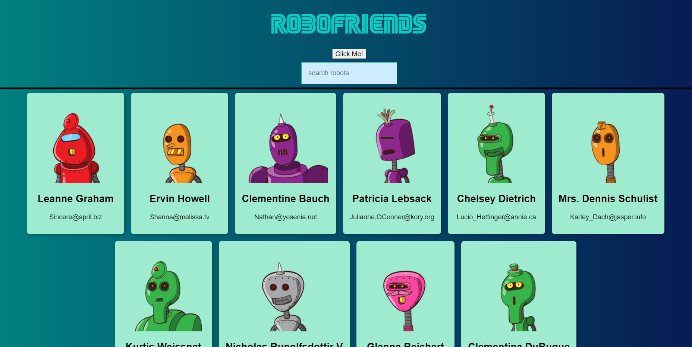
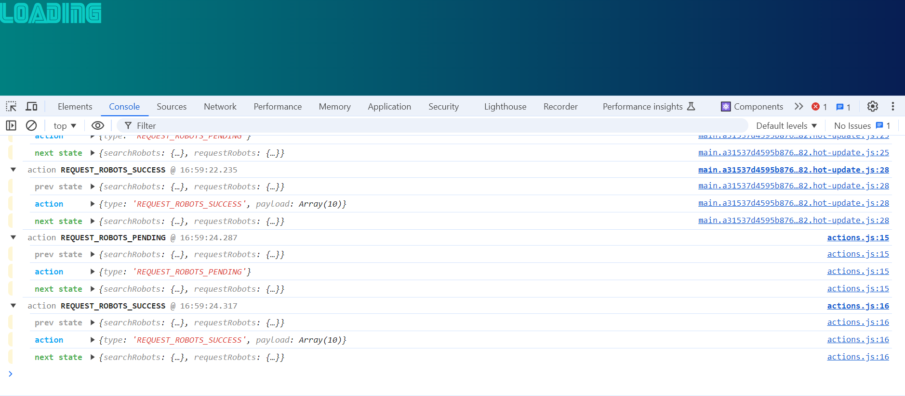

# 🚀 RoboFriends - Your Interactive Robot Companions

Welcome to RoboFriends, where the future meets friendship! 🤖✨ This React and Redux-powered application brings a squad of quirky robots to life, ready to be your digital buddies. Harnessing the power of [JSONPlaceholder](https://jsonplaceholder.typicode.com/users), RoboFriends not only showcases the magic of React and Redux but also makes connecting with robots an exhilarating experience.

## 📸 Screenshots

## 🌈 Features That Make RoboFriends Shine

- **Dynamic Search:** Seamlessly find your robotic pals by typing their names into our interactive search bar.
- **Centralized State Management with Redux:** Enjoy a smooth user experience with Redux handling the state of your robot friends and search functionality.
- **Responsive Design:** Whether you're on a desktop or a mobile device, RoboFriends adapts to provide a seamless experience.
- **Loading Excitement:** Witness the loading indicator as RoboFriends fetches the latest robot data – it's like unwrapping a gift!

## 🛠 Technologies Used

- [React](https://reactjs.org/) - For building the user interface.
- [Redux](https://redux.js.org/) - For managing the application's state.
- [React-Redux](https://react-redux.js.org/) - For integrating Redux with React.
- [Redux Thunk](https://github.com/reduxjs/redux-thunk) - For handling asynchronous actions in Redux.
- [Redux Logger](https://github.com/LogRocket/redux-logger) - For logging actions and state changes, making debugging easier.
- [React DOM](https://reactjs.org/docs/react-dom.html) - For DOM manipulation in React.
- [React Scripts](https://create-react-app.dev/docs/available-scripts/) - For running and building the React app.
- [Tachyons](https://tachyons.io/) - For quick and easy styling.
